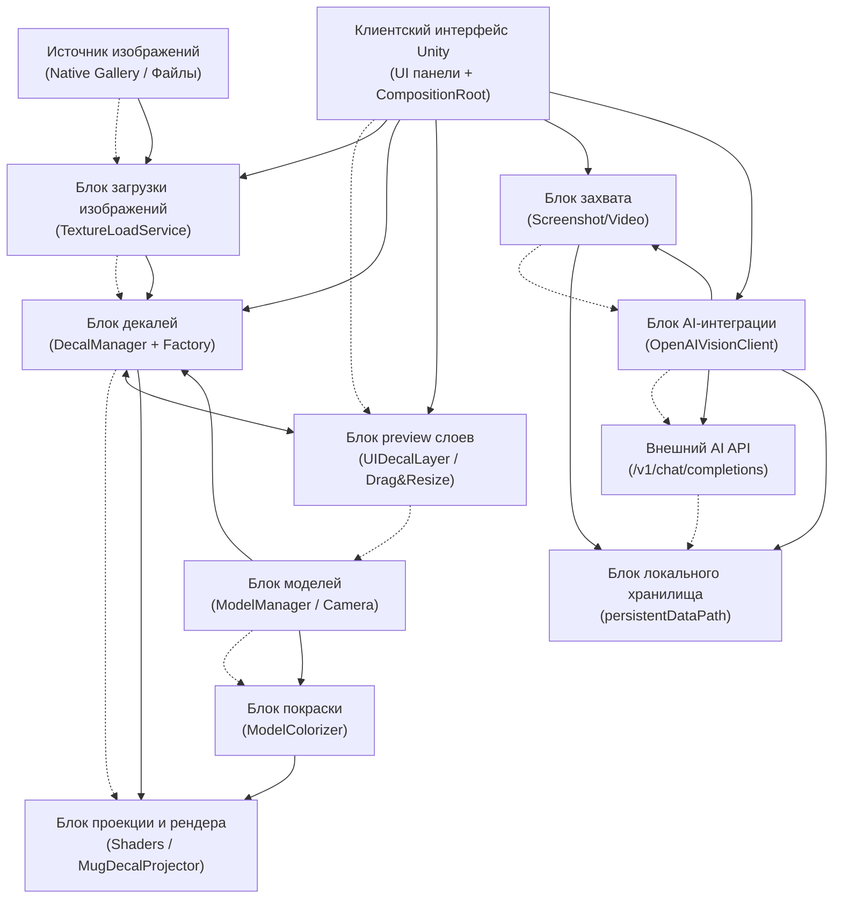

# Структурная схема Fotocentr

```mermaid
flowchart TB
    %% Верхний ряд
    imgsrc["Источник изображений<br/>(Native Gallery / Файлы)"]
    imgload["Блок загрузки изображений<br/>(TextureLoadService)"]
    decal["Блок декалей<br/>(DecalManager + Factory)"]
    render["Блок проекции и рендера<br/>(Shaders / MugDecalProjector)"]

    %% Средний ряд
    ui["Клиентский интерфейс Unity<br/>(UI панели + CompositionRoot)"]
    preview["Блок preview слоев<br/>(UIDecalLayer / Drag&Resize)"]
    model["Блок моделей<br/>(ModelManager / Camera)"]
    color["Блок покраски<br/>(ModelColorizer)"]

    %% Нижний ряд
    capture["Блок захвата<br/>(Screenshot/Video)"]
    ai["Блок AI-интеграции<br/>(OpenAIVisionClient)"]
    extapi["Внешний AI API<br/>(/v1/chat/completions)"]
    storage["Блок локального хранилища<br/>(persistentDataPath)"]

    %% Компоновка по рядам (невидимые связи для выравнивания)
    imgsrc -.-> imgload -.-> decal -.-> render
    ui -.-> preview -.-> model -.-> color
    capture -.-> ai -.-> extapi -.-> storage

    %% Функциональные связи
    imgsrc --> imgload
    imgload --> decal

    ui --> imgload
    ui --> decal
    ui --> preview
    ui --> capture
    ui --> ai

    decal <--> preview
    decal --> render

    model --> decal
    model --> color
    color --> render

    ai --> capture
    ai --> extapi
    ai --> storage
    capture --> storage
```

